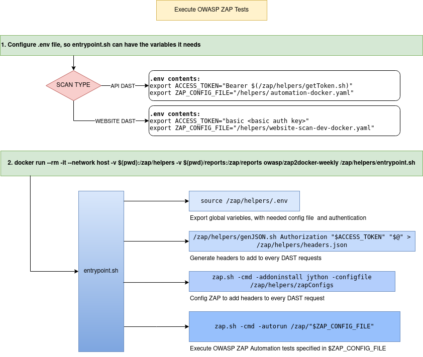
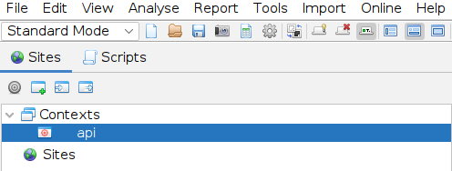
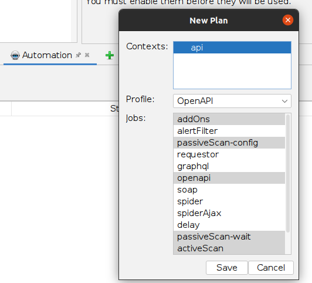
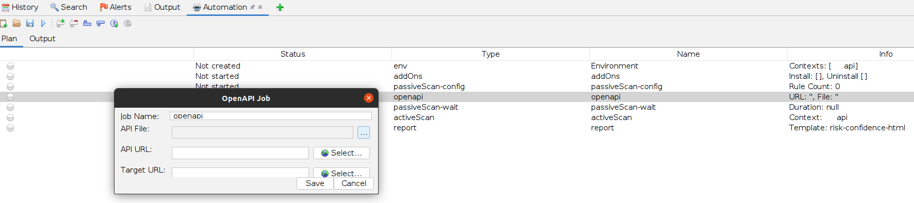

# Owasp Zap Helpers

A set of scripts and Docker entrypoints, so zap development and use becomes
simpler.

All of these scripts will be used in TALOS program. But they can also
serve as plug-ins, following the Unix philosophy, to build the environment
surrounding the OWASP zap server automation job.

### Baisc flow:




### TLDR;

#### Files needed to configure **API** tests:

* ZAP Automation API config file. 
* Scalefast V5 API OpenAPI file. (This file is used in the ZAP Automation API config file)
* `.env` file that specifies what files and auth is to be used

#### Files needed to configure **DAST** tests:

* `full-scan-dev-docker.yaml`
* `.env` file that specifies what files and auth is to be used

To get more info on specific files or steps, continue reading. 

#### Command to run DAST tests:

From within the root directory in this repository, run the following command:

`docker run --rm -it --network host -v $(pwd)/env:/zap/env -v $(pwd)/report:/zap/report owasp/zap2docker-weekly /zap/env/entrypoint.sh`

## Setup

The OWASP ZAP tool has been Dockerized by the OWASP team, therefore, we can run
the analysis in a container, so it's all auto-contained.

With these helper scripts, you can perform DAST tests on API's and websites.
The only configuration the whole environment requires is a `.env` file. (But more on that shortly)
that specifies where the location of the OWASP ZAP test configuration is, and
the authentication mechanism the tests will be using.
 
Through the `entrypoints.sh` script, we will tell Zap to read these files to
figure out what fields the API can handle, or what website to scan and
perform the analysis.

To attack the API, zap needs to be authenticated with the API, otherwise, it
will not work, every request sent will respond with a error stating the user
has not been authenticated, so, to make real progress, we have to get ourselves
authenticated.
The same goes with the stores, we have to get through a authentication prompt.
This is the main reason we have to build the environment dynamically.

Once we have finished the set-up, the result will be being able to run
the analysis thing with a single docker command from within this project's env
directory:

`docker run --rm -it --network host -v $(pwd):/zap/env -v $(pwd)/reports:/zap/reports owasp/zap2docker-weekly /zap/env/entrypoint.sh`

In this command, we:

Attach the container to the local network, so we have access to the API (Being
hosted from our machine (Remember to set the DNS records in `/etc/hosts` if this
is your case))

Map two volumes:

* This project's root directory into /zap/env
* ./reports/ into /zap/reports (Because according to the automation plan, here
  is where we are going to store the report output)

And call the Docker entrypoint script.

Let's take a look at the scripts.

### getToken.sh

This script makes a request to the API endpoint we want to test with the correct
parameters, and retrieves a response, which then is filtered to obtain the
`access_token` we need to add to every other request we make to the API.
It will output the token we need to `stdout`.

### genJson.sh

This script generates a very simple json file.  It only allows key-value pairs,
but this is all wee need, as the headers are configured in the same way.

To use this script, we have to execute it with the pairs of header values, like
so:

`./genJson.sh Accept Application/json`

The first parameter will be the header key, and the second parameter will be the
header value. You can pass as many parameters as you wish, but they have to be
in pairs.
The output prints a json file to `stdout`, like so:

```
➜  ZAP git:(master) ✗ ./genJSON.sh Accept application/json
{
  "Accept":"application/json"
}
```

This script uses variable `$#` and the `shift` statement, to iterate over the
parameters passed from outside.  The while has to be > 3 because the first
parameter is the script name, and we have to control for the last key/value
pair, as they don't have the `,` at the end of the field. 
This script also prints to `stdout`.

### add-headers.py

OWASP ZAP httpsender scripts call two functions: `sendingRequest`, and `responseReceived`.
`sendingRequest` is called before the request is sent, and `responseReceived`
is called after the response is obtained.

This script's logic is very straight forward.

1. Get the headers from `/zap/env/headers.json` (file generated in `entrypoint.sh`)
1. Add the headers to the requests if the request does not come from initiator
   7 (`CHECK_FOR_UPDATES_INITIATOR`)

If the headers are sent during initiator 7, the program exits, as the server
doesn't understand the request, and fails downloading the `jython` plugin.

Remember to change the file directory if you modify the program flow, as it's
hardcoded into the script because it doesn't accept external parameters.

### v5-api-dev-automation-docker.yaml

This serves as the ZAP configuration file.
It is the file that tells ZAP what scans to run, where the OpenAPI schema file
is located, where to store the report, and every other minor detail it needs to
run the analysis.

To configure the file, open the ZAP program in your desktop, configure the
desired test-suite and environment.



After, open the Automation section, and configure that, and after, save the file.





Remember to set the environment in the automation framework (Bottom right side)
and other settings, like the OpenAPI schema the automation framework is going to
need for the analysis.

The most important parts of this file are:

#### Context

Sets the context to be used in the automation scan

```
env:
  contexts:
  - name: "api-dev"
    urls:
    - "https://<your API URL>/*"
    includePaths:
    - "https://<your API URL>/*"
```

#### OpenAPI schema location

Tells ZAP the location of the Open Api Schema for the API endpoints

```
- parameters:
    apiFile: "/zap/env/OpenAPISchema.json"
    apiUrl: ""
    targetUrl: ""
  name: "openapi"
  type: "openapi"
```

#### Scan report location

Tells ZAP where to store the report (This is why we have added another volume
to the Docker command, so we can retrieve the scan report)

```
- parameters:
    template: "risk-confidence-html"
    theme: "original"
    reportDir: "/zap/reports/"
    reportFile: ""
    reportTitle: "ZAP Scanning Report"
    reportDescription: ""
```

### entrypoint.sh

This is where it all comes together.
In this script, we configure the environment we need for ZAP to work.

* Get the token we need for authentication
* Generate a json file with this token for the `add-headers.py` script to use
* Download the jython ZAP extension
* Configure the ZAP program, to send the headers on every request to API
* Run the actual test suite

Ideally, all these steps should be configured through a single configuration
file, ´config.json´ but it is currently not possible. The ZAP team are
currently working towards this.

#### Get the token and generate the ´headers.json´ file

The command `source /zap/env/.env` file exports the variables we are going
to use in this script.

If the test is API DAST, then we have to set the `ACCESS_TOKEN` variable to
`Bearer $(/zap/env/getToken.sh)`, which will expand at execution time, and
use the `getToken.sh` script to obtain a token from our API.
For clarity, the `.env` file would look like this for the DAST API tests:

```
export ACCESS_TOKEN="Bearer $(/zap/env/getToken.sh)"
export ZAP_CONFIG_FILE="/env/automation-docker.yaml"
```

If the test is a DAST on a website, then we have to set the `ACCESS_TOKEN`
variable to the token generated once we bypass the basic auth authentication
mechanism.
The `.env` file would look like this for the DAST tests on websites:

```
export ACCESS_TOKEN="basic <basic auth key>"
export ZAP_CONFIG_FILE="/env/full-scan-dev-docker.yaml"
```

Let's now pass to the next real command:

`/zap/env/genJSON.sh Authorization "$ACCESS_TOKEN" "$@" > /zap/env/headers.json`

There is quite a bit to unpack here.
Let's start with the script path.
As we are using the Docker command:

`docker run --rm -it --network host -v $(pwd):/zap/configs -v $(pwd)/reports:/zap/reports owasp/zap2docker-weekly /zap/env/entrypoint.sh`

We access all the scripts and configs through the `/zap/env/` directory.

The `genJson.sh` command takes two hardcoded parameters, which take care of the
`Authorization` header and all those sent through the `entrypoint.sh`
script. (This is achieved through the `"$@"` variable.  This way, we can add
headers to the requests directly from our host machine like so:

`docker run --rm -it --network host -v $(pwd)/env:/zap/env -v $(pwd)/report:/zap/report owasp/zap2docker-weekly /zap/env/entrypoint.sh`

The above command would run the `genJson.sh` script with four parameters:
`Authorization` `bearer "$(./env/getToken.sh)"` `Accept`
`application/json`, which in turn, would generate a `json` file like so:

```
{
  "Authorization": "bearer <Very long char string>",
  "Accept": "application/json"
}
```

This makes for a very extensible and easy setup.

The `$ACCESS_TOKEN` variable enables us to change the variable based on the type
of test we are performing, as the API DAST test uses bearer, and stores use
basic auth.
 
Finally, we write the output to `/zap/env/headers.json` file, for
`add-headers.py` to use.

#### Downloading the jython ZAP extension

Currently, ZAP has a bug that prevents the automation plan to run if it also
has to install a plug-in, therefore, we have to run zap twice.
One for configuration, and another to run the plan.

`zap.sh -cmd -addoninstall jython -configfile /zap/env/zapConfigs`

As you can see in the command above, we also configure zap to configure some
settings, like enable a python script.

All these settings are required to enable a script in ZAP.  To find out what
settings you have to add to the config file, you can configure a specific ZAP
application using `zap.sh -dir <absolute dir path>` command to
change it's config directory, then add the settings you want to run in the Docker
automation run, and then, once ZAP GUI application is configured, open
`<absolute dir path>/config.xml` to figure out the parameters needed for the
specific feature to be added to the automation plan.
[Here](https://www.zaproxy.org/faq/how-do-you-find-out-what-key-to-use-to-set-a-config-value-on-the-command-line/)
is a very good starting point which we to figure it all out.

At this point, we have ZAP configured to run this script on every request being
made.
We only have to tell ZAP to run with the configured environment settings.

#### Run the tests

We finally tell ZAP to run the scan based on the
`$ZAP_CONFIG_FILE` configurations.
Remember we are setting this file in the `.env` file.

`zap.sh -cmd -autorun /zap/$ZAP_CONFIG_FILE`

## Execution

The contents of the `env` directory should look like this, if you want to be
able to execute DAST web and DAST API scans:

```
env/
├── auth_post_request.json
├── entrypoint.sh
├── full-scan-dev-docker.yaml
├── genJSON.sh
├── getToken.sh
├── headers.json
├── reports/                            (Scan reports will be stored here)
├── scripts
│   └── httpsender
│       └── add-headers.py
├── users-service.json                  (Open Api Schema, required for ZAP analysis)
├── automation-docker.yaml              (API ZAP Automation report, generated with ZAP GUI)
└── zapConfigs                          (Configs added to Docker ZAP, to execute on second run)

3 directories, 10 files
```

Execute the docker command in the directory where all these scripts are
stored, and when the analysis has finished, the report will output in the
reports directory.

`docker run --rm -it --network host -v $(pwd):/zap/env -v $(pwd)/reports:/zap/reports owasp/zap2docker-weekly /zap/env/entrypoint.sh`

There is only one script location exception.  This is `add-headers.py`, because
ZAP GUI requires it to be stored in a directory that states what type of script
it is, therefore, we stored it inside: `scripts/httpsender/add-headers.py`.

If the `add-headers.py` script has been loaded correctly and is working, for
every request sent, it will output: `Headers added to request`, and for every
response received, it will output: `response received`.

If the script does not work, it will be disabled, but the scan will not stop.
We have found it is a good approach to print something in the script, just to
make sure it is working correctly.

